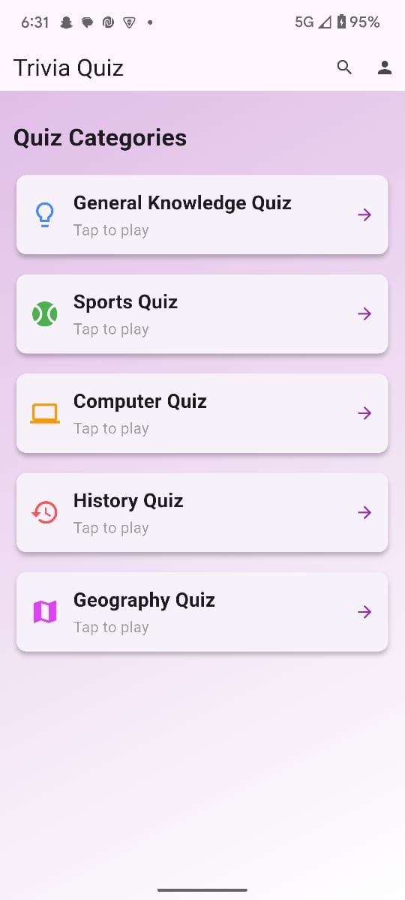
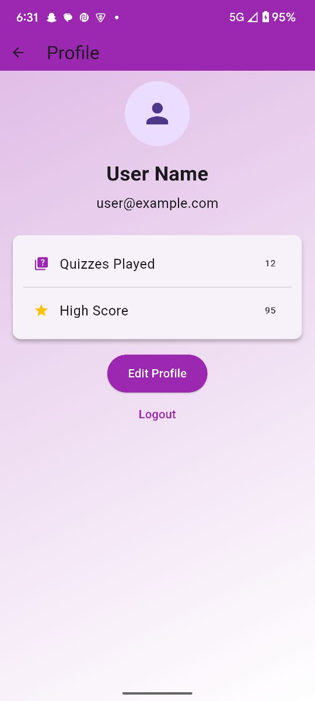
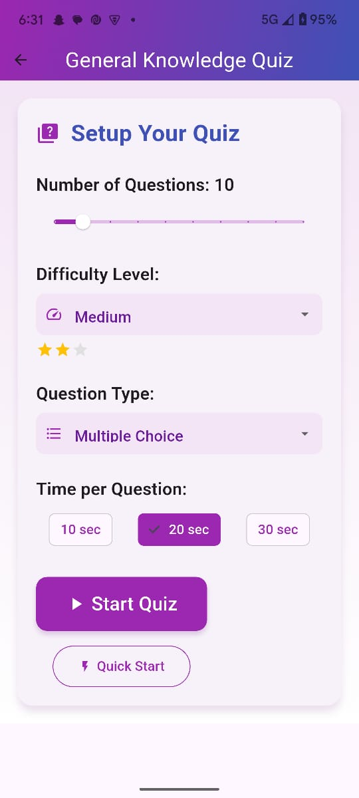
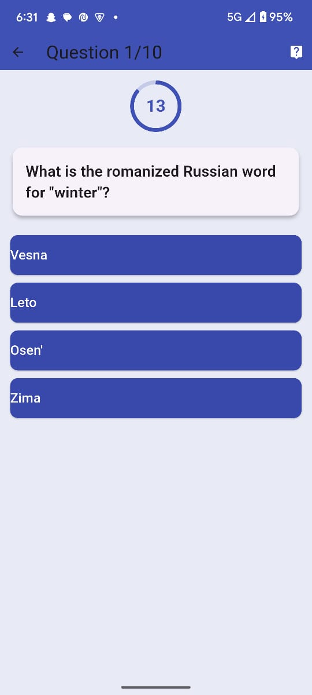

# Flutter Quiz App

A dynamic and interactive quiz application built with Flutter, designed to deliver a personalized and engaging experience for users. The app utilizes public APIs to fetch quiz questions across various categories and offers a range of customization options.

---

## ✨ Features

- **Modern Home & Category Selection**
  - Visually appealing home screen with quiz categories as cards, icons, and gradients.
  - Easy navigation: tap any category to start customizing your quiz.

---

- **Profile & Progress Tracking**
  - Profile dashboard with username, email, quizzes played, and high score.
  - Edit profile and logout options for easy management.

---

- **Customizable Quiz Setup**
  - Choose number of questions, difficulty (with visual stars), question type, and time per question.
  - Quick Start option for instant play.

---

- **Interactive Quiz Experience**
  - Time-limited questions with a countdown timer.
  - Clear, accessible layout for questions and answers.

---

## 📱 Tech Stack

- **Frontend:** Flutter  
- **Data Source:** Open Trivia Database (public trivia API)
- **State Management:** setState (can be extended to Provider or Riverpod)
- **Local Storage:** SharedPreferences / Hive (for storing quiz history and scores)

---

## 🚀 How It Works

1. **Start on the Home Screen:**  
   Browse and select a quiz category.
2. **Customize Your Quiz:**  
   Set your preferences for question count, difficulty, type, and timer.
3. **Play & Track Progress:**  
   Answer questions against the clock, see your score, and review your stats in the profile section.

---

Enjoy learning and challenging yourself with the **Flutter Quiz App**!
